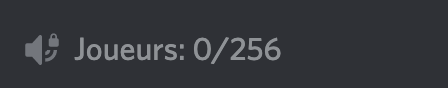

# Discord Players FiveM

Small nodeJS script allowing to change the name of a channel with the number of current players playing on your server!
No need for the players.json file or anything else, the script does not use the FiveM server but the FiveM link so nothing needs to be changed on the GTA server side.

## Prerequisites

- Node server or Node Local with version > 16.x

## How To Use

1. Clone this project into a folder on your machine or on your node server

2. execute 'npm install' to install dependencies of this project

3. Configure and Invite the bot to your server:
    - If you say how to work => [Discord Developer Portal](https://discord.com/developers/applications)
    - If not
      => [How to create a bot ?](https://github.com/reactiflux/discord-irc/wiki/Creating-a-discord-bot-&-getting-a-token)

4. In the file 'index.js' at the top change this variables :

- TOKEN_BOT => bot token

- URL_FIVEM => Enter the FiveM detail url of your ex server (https://servers.fivem.net/servers/detail/id)

- ID_CHANNEL_PLAYERS => Enter the identifier of the channel where you want the number of players to appear (if you do
  not know how to copy the identifier, you must put yourself in developer mode on discord and right click on the channel
  then copy the identifier )

7. Start script with 'node index.js'

8. Enjoy !

Exemple of result:

